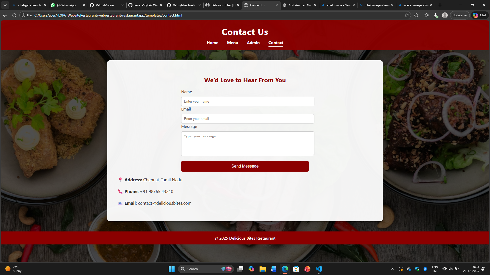

# Ex.06 Restaurant Website
## Date:26-11-2025

## AIM:
To develop a static Restaurant website to display the food items and services provided by them.

## DESIGN STEPS:

### Step 1:
Requirement collection.

### Step 2:
Creating the layout using HTML and CSS.

### Step 3:
Updating the sample content.

### Step 4:
Choose the appropriate style and color scheme.

### Step 5:
Validate the layout in various browsers.

### Step 6:
Validate the HTML code.

### Step 7:
Publish the website in the given URL.

## PROGRAM:
```
index.html
<!DOCTYPE html>
<html lang="en">
<head>
  <meta charset="UTF-8">
  <title>Delicious Bites | Home</title>
  <link rel="stylesheet" href="style.css">
</head>
<body>

<header>
  <h1>Delicious Bites Restaurant</h1>
  <nav>
    <a href="index.html">Home</a>
    <a href="menu.html">Menu</a>
    <a href="admin.html">Admin</a>
    <a href="contact.html">Contact</a>
  </nav>
</header>

<div class="container">
  <h2>Welcome to Delicious Bites</h2>
  <p>Experience the taste of happiness with our freshly prepared dishes made by professional chefs.</p>

  <div class="team">
    <div class="member">
      <h3>🍽️ Quality Food</h3>
      <p>Fresh ingredients & authentic recipes</p>
    </div>

    <div class="member">
      <h3>👨‍🍳 Expert Chefs</h3>
      <p>Experienced & professional kitchen staff</p>
    </div>

    <div class="member">
      <h3>🚀 Fast Service</h3>
      <p>Quick delivery and friendly service</p>
    </div>
  </div>
</div>

<footer>
  © 2025 Delicious Bites Restaurant
</footer>

</body>
</html>

menu.html
<!DOCTYPE html>
<html>
<head>
  <title>Menu</title>
  <link rel="stylesheet" href="style.css">
</head>
<body>

<header>
  <h1>Our Menu</h1>
  <nav>
    <a href="index.html">Home</a>
    <a href="menu.html">Menu</a>
    <a href="admin.html">Admin</a>
    <a href="contact.html">Contact</a>
  </nav>
</header>

<div class="container">
  <h2>Delicious Dishes</h2>

  <div class="team">
    <div class="member">
      <h3>Grilled Chicken</h3>
      <p>₹250</p>
    </div>

    <div class="member">
      <h3>Veg Biryani</h3>
      <p>₹180</p>
    </div>

    <div class="member">
      <h3>Paneer Butter Masala</h3>
      <p>₹220</p>
    </div>
  </div>
</div>

<footer>
  © 2025 Delicious Bites
</footer>

</body>
</html>

admin.html
<!DOCTYPE html>
<html>
<head>
  <title>Admin - Team</title>
  <link rel="stylesheet" href="style.css">
</head>
<body>

<header>
  <h1>Admin - Team Profiles</h1>
  <nav>
    <a href="index.html">Home</a>
    <a href="menu.html">Menu</a>
    <a href="admin.html">Admin</a>
    <a href="contact.html">Contact</a>
  </nav>
</header>

<div class="container">
  <h2>Our Team</h2>

  <div class="team">

    <div class="member">
      
      <h3>Chef</h3>
    </div>

    <div class="member">
      
      <h3>Owner</h3>
    </div>

    <div class="member">
      
      <h3>Manager</h3>
    </div>

    <div class="member">
      
      <h3>Waiter</h3>
    </div>

    <div class="member">
      
      <h3>Cleaner</h3>
    </div>

  </div>
</div>

<footer>
  © 2025 Delicious Bites Restaurant
</footer>

</body>
</html>

contact.html
<!DOCTYPE html>
<html lang="en">
<head>
  <meta charset="UTF-8">
  <title>Contact Us</title>
  <link rel="stylesheet" href="style.css">
</head>
<body>

<header>
  <h1>Contact Us</h1>
  <nav>
    <a href="index.html">Home</a>
    <a href="menu.html">Menu</a>
    <a href="admin.html">Admin</a>
    <a href="contact.html">Contact</a>
  </nav>
</header>

<div class="container">
  <h2>We’d Love to Hear From You</h2>

  <form>
    <div class="form-group">
      <label>Name</label><br>
      <input type="text" placeholder="Enter your name" required>
    </div>

    <div class="form-group">
      <label>Email</label><br>
      <input type="email" placeholder="Enter your email" required>
    </div>

    <div class="form-group">
      <label>Message</label><br>
      <textarea rows="5" placeholder="Type your message..."></textarea>
    </div>

    <button type="submit">Send Message</button>
  </form>

  <div class="contact-info">
    <p><strong>📍 Address:</strong> Chennai, Tamil Nadu</p>
    <p><strong>📞 Phone:</strong> +91 98765 43210</p>
    <p><strong>📧 Email:</strong> contact@deliciousbites.com</p>
  </div>
</div>

<footer>
  © 2025 Delicious Bites Restaurant
</footer>

</body>
</html>

style.css
/* ================= GLOBAL ================= */
body {
  margin: 0;
  font-family: 'Segoe UI', Arial, sans-serif;
  background: linear-gradient(
      rgba(0, 0, 0, 0.65),
      rgba(0, 0, 0, 0.65)
    ),
    url("https://images.unsplash.com/photo-1504674900247-0877df9cc836?auto=format&fit=crop&w=1600&q=80");
  background-size: cover;
  background-position: center;
  background-attachment: fixed;
  color: #fff;
}

/* ================= HEADER ================= */
header {
  background: rgba(139, 0, 0, 0.95);
  padding: 20px;
  text-align: center;
}

header h1 {
  margin: 0;
  font-size: 34px;
  letter-spacing: 1px;
}

nav {
  margin-top: 10px;
}

nav a {
  color: #fff;
  text-decoration: none;
  margin: 0 15px;
  font-weight: bold;
  font-size: 16px;
  padding-bottom: 4px;
}

nav a:hover {
  border-bottom: 2px solid #fff;
}

/* ================= MAIN CONTAINER ================= */
.container {
  background: rgba(255, 255, 255, 0.95);
  color: #333;
  margin: 40px auto;
  max-width: 1000px;
  padding: 40px;
  border-radius: 10px;
  box-shadow: 0 0 25px rgba(0, 0, 0, 0.4);
}

.container h2 {
  text-align: center;
  margin-bottom: 20px;
  color: #8b0000;
}

.container p {
  font-size: 17px;
  line-height: 1.7;
}

/* ================= TEAM / CARDS ================= */
.team {
  display: flex;
  flex-wrap: wrap;
  justify-content: center;
  gap: 25px;
  margin-top: 30px;
}

.member {
  background: #fff;
  width: 220px;
  border-radius: 12px;
  text-align: center;
  padding: 15px;
  box-shadow: 0 6px 15px rgba(0, 0, 0, 0.25);
  transition: transform 0.3s ease;
}

.member:hover {
  transform: translateY(-8px);
}

.member img {
  width: 100%;
  height: 180px;
  object-fit: cover;
  border-radius: 10px;
}

.member h3 {
  margin-top: 12px;
  color: #8b0000;
}

/* ================= FORM ================= */
form {
  max-width: 500px;
  margin: auto;
}

```

## OUTPUT:
-1.png>)
.png>)
.png>)
.png>)


## RESULT:
The program for designing software company website using HTML and CSS is completed successfully.
